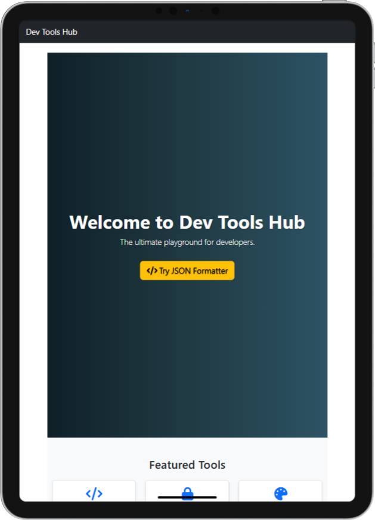

<div align="center">
  
</div>

## 1. Introduction

**Dev Tools Hub** is a React-based web application (built with Vite and Bootstrap 5) that provides developers with a set of handy utilities. It demonstrates modern React practices—routing, hooks, context, custom hooks, lazy loading—and it's fully responsive with beautiful styling and interactions.

---

## 2. Used Technologies

- **Front-End**:

  - React (functional components + hooks)
  - React Router DOM
  - Bootstrap 5
  - Font Awesome icons

- **Build Tool**:
  - Vite (fast development experience)

---

## 3. Prerequisites

Ensure you have installed:

- Node.js v16+ and npm
- Git (optional, for cloning)
- Web browser (Chrome/Firefox/etc.)

---

## 4. Installation & Environment Setup

1. **Clone the repository**

   ```bash
   git clone <repo-url>
   cd Dev-Tools-Hub
   ```

2. **Install dependencies**

   ```bash
   npm install
   ```

3. **Run development server**

   ```bash
   npm run dev
   ```

4. Open [http://localhost:5173](http://localhost:5173) to view the app.

---

## 5. Project Structure

```
DevToolsHub/
├── public/
│   ├── assets/
│   │   ├── fontawesome/
│   │   │   ├── css/all.min.css
│   │   │   └── webfonts/
│   └── thumbnail.png
│
├── src/
│   ├── components/
│   │   ├── Header.jsx
│   │   ├── Footer.jsx
│   ├── pages/
│   │   ├── Home.jsx
│   │   ├── JsonFormatter.jsx
│   │   ├── Base64Tool.jsx
│   │   ├── ColorPicker.jsx
│   │   └── NotFound.jsx
│   ├── styles/
│   │   └── Home.css
│   │   └── ColorPicker.css
│   ├── hooks/
│   │   └── useLocalStorage.js
│   ├── utils/
│   │   └── colorUtils.js
│   ├── App.jsx
│   └── main.jsx
│
├── package.json
├── vite.config.js
└── README.md
```

---

## 6. Configuration

### Inside `package.json`:

```json
{
  "name": "dev-tools-hub",
  "version": "1.0.0",
  "scripts": {
    "dev": "vite",
    "build": "vite build",
    "preview": "vite preview"
  },
  "dependencies": {
    "react": "^18.2.0",
    "react-dom": "^18.2.0",
    "react-router-dom": "^6.x",
    "bootstrap": "^5.x",
    "@fortawesome/fontawesome-free": "^6.x"
  },
  "devDependencies": {
    "@vitejs/plugin-react": "^4.x",
    "vite": "^5.x"
  }
}
```

### In `main.jsx`:

```js
import "bootstrap/dist/css/bootstrap.min.css";
import "@fortawesome/fontawesome-free/css/all.min.css";
```

---

## 7. Features & Functionality

### Homepage (`/`)

- Animated hero section with call-to-action
- Grid of featured tools (cards with icons and links)
- Smooth hover animations and highlight effects

### Tools Implemented

- **JSON Formatter**: Validate and pretty-print JSON
- **Base64 Tool**: Encode/decode text with copy-to-clipboard
- **Color Palette Generator**: Generate random colors; click to copy; export CSS variables

### Not Found Page (`*`)

- Renders a custom "404 – Page Not Found" for invalid routes

---

## 8. React Concepts in Use

- `useState` & `useEffect`
- React Router for routing
- Nested route structure for scalability
- Component reusability (Header, Footer, Tool cards)
- Custom hooks (`useLocalStorage`) for persisting
- Utility functions (`colorUtils.js`) for color transformations

---

## 9. Styles, Animations & UX

- Responsive layout via Bootstrap grid
- Hover and transition effects on cards & buttons
- Hero section background gradient and fade animations
- Copy indicators (e.g. "Copied!" badge on color swatches)

---

## Accessibility & Performance

- Keyboard focus states and aria labels where needed
- Light-weight—only required dependencies
- Lazy loading hooks or tool pages (if added later)

---

## How to Extend

- Add additional tools (e.g., QR Code generator, Regex tester)
- Enhance UI with modals or AOS scroll animation
- Add theme toggle (dark/light mode)
- Add favorites or history state via context

---

## Credits & Licensing

Dev Tools Hub is built by Omar Ayman as ITI summer training React course, 2025.
Feel free to reuse the code for your own learning or projects — a star ⭐ on GitHub is appreciated!

---

## Let's get coding

Ready to explore tools that every developer needs?
Start your dev server with `npm run dev` and pick a tool to get started!

---

Happy coding!
